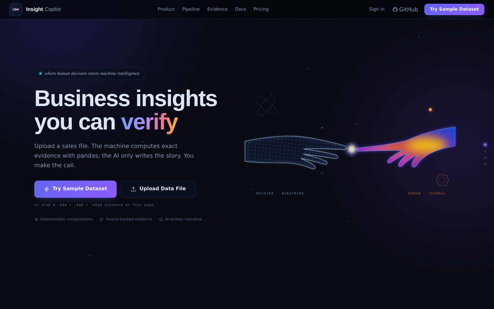
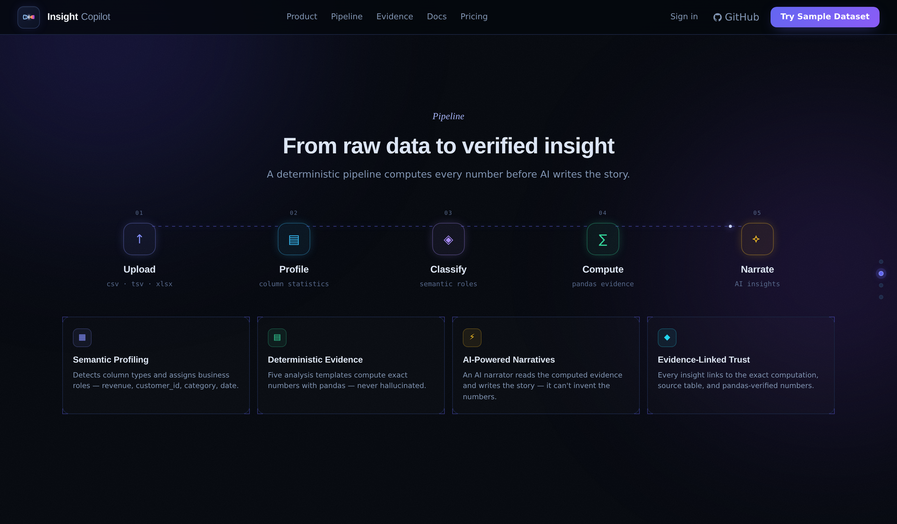
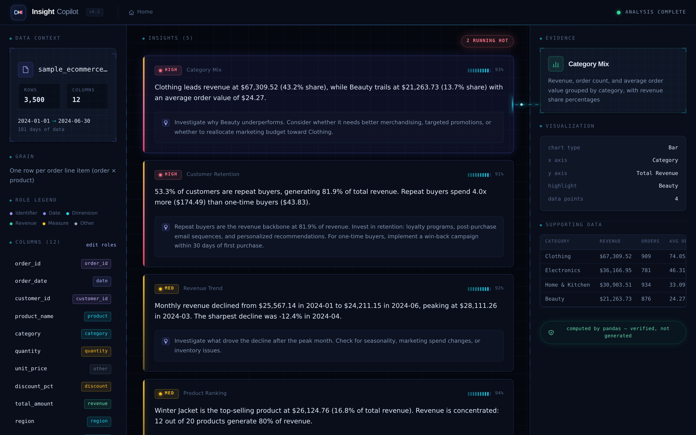
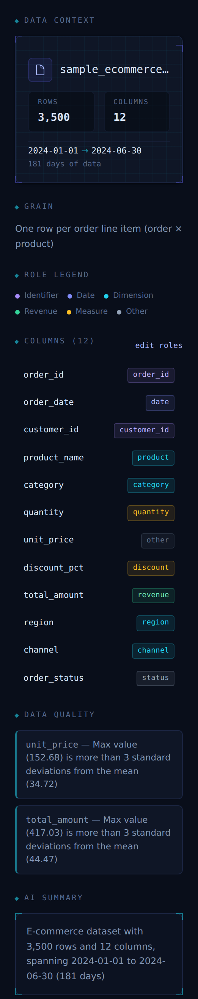
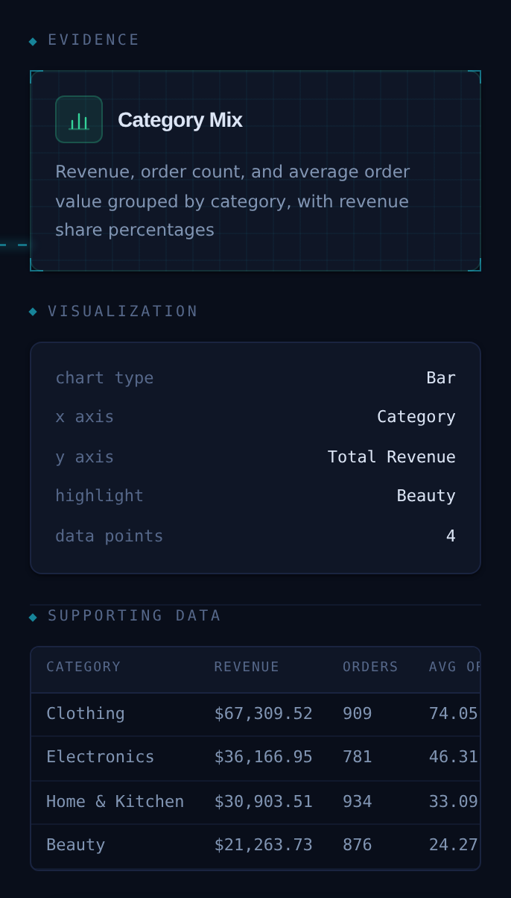

# Insight Copilot

**Evidence-first AI analytics — pandas computes the numbers, AI tells the story.**

Insight Copilot is an evidence-first AI analytics assistant. Pandas computes verified evidence from your data, Claude turns that evidence into a clear business narrative, and every insight links back to the exact computation, template, and data slice behind it — so nothing you read is a claim you have to take on faith. Built as an AI analytics product prototype demonstrating AI engineering, data pipeline design, and full-stack product development, currently applied to e-commerce business data.

> **This is not a ChatGPT wrapper.** The system never lets an LLM compute numbers. Pandas computes the evidence. The AI writes the narrative. Every insight links back to the exact computation that produced it.

---

## The Problem

Most AI analytics tools follow the same pattern: paste your CSV into a chat window, hope the model gets the numbers right. This approach has three failure modes that make it unsuitable for real business decisions:

1. **Numerical hallucination** — LLMs routinely miscompute aggregations, percentages, and growth rates. A model might report "revenue grew 23%" when the actual figure is 18%.

2. **No audit trail** — when a chatbot says "your top category is Electronics," there's no way to verify the claim without re-doing the analysis yourself.

3. **No persistent understanding** — every session starts from zero. The system doesn't build a structured model of what your data contains or what's been analyzed before.

Insight Copilot solves all three by separating concerns: deterministic computation (pandas) handles the math, semantic profiling (AI) handles understanding, and narrative synthesis (AI) handles communication — each doing what it's best at.

---

## Key Features

**Multi-format Data Ingestion** — Users can upload CSV, TSV, and Excel (.xlsx) files. The ingestion layer validates and parses files into pandas DataFrames before passing them into the same evidence-first analysis pipeline.

**Two-Stage Data Profiling** — After upload, a pandas-based profiler computes exact statistics (dtypes, distributions, nulls, cardinality, date ranges). Then an AI classifier assigns semantic business roles to each column using the statistical profile — not raw data. Supports both English and Chinese column-name semantic mapping.

**Evidence-Linked Insights** — Every insight carries a typed `Evidence` object containing the template that produced it, the exact data slice, chart metadata, and a description of the computation. The LLM receives these pre-computed evidence objects and writes narratives constrained to the numbers inside them, so it cannot hallucinate figures because it never computes them. The frontend renders each insight as an expandable audit trail with supporting data tables.

**Analysis Template Registry** — Five self-contained analysis templates (revenue trend, category comparison, top products, AOV analysis, repeat purchase), each declaring the semantic roles it requires. The registry auto-selects which templates can run based on the dataset's column classifications. Adding a new analysis is one file — no existing code changes.

**Three-Panel Analytical Workspace** — A dark-themed React + TypeScript dashboard with Data Context (left), Insight Feed (center), and Evidence Details (right). The Data Context panel shows the dataset profile, semantic role legend, dimensions, and measures. The Insight Feed shows prioritized business insights with actionable recommendations. The Evidence Panel shows the computation description, key metrics, visualization metadata, and a supporting data table — with a trust badge confirming all numbers are pandas-verified.

**Landing Page with Product Preview** — A SaaS-style landing page with a split hero layout, embedded product mockup, pipeline visualization, and one-click access to a sample dataset. Users see what the product does before loading any data.

---

## Why This Is Different

| Approach | How numbers are produced | Audit trail | Adapts to schema |
|---|---|---|---|
| ChatGPT + CSV | LLM estimates from raw text | None | No |
| Notebook + pandas | Manual code per dataset | Code cells | Manual |
| **Insight Copilot** | Pandas templates, auto-selected | Every insight → Evidence object | Semantic role detection |

The architecture follows a production-oriented AI analytics pattern: separating deterministic computation from AI-generated explanation to improve reliability and trust.

---

## Architecture

```
CSV Upload
  → Deterministic Profiling (pandas: dtypes, statistics, date ranges)
  → Semantic Role Mapping (Claude API or mock classifier)
  → Evidence Templates (5 pandas-based analysis templates, auto-selected)
  → AI Narrative Generation (Claude API or mock narrator)
  → Evidence-Linked Dashboard (React three-panel workspace)
```

```
                         ┌─────────────────────────────────────────────┐
                         │              React + TypeScript             │
                         │  ┌───────────┬──────────────┬────────────┐  │
                         │  │   Data    │   Insight    │  Evidence  │  │
                         │  │  Context  │    Feed      │   Panel    │  │
                         │  └───────────┴──────────────┴────────────┘  │
                         └──────────────────┬──────────────────────────┘
                                            │ REST API
                         ┌──────────────────▼──────────────────────────┐
                         │              FastAPI Backend                │
                         │                                             │
  ┌───────────┐          │  ┌─────────────┐    ┌──────────────────┐    │
  │ Data file │──upload──│─▶│Deterministic│───▶│    Semantic      │    │
  └───────────┘          │  │  Profiler   │    │   Classifier     │    │
                         │  │  (pandas)   │    │   (Claude/Mock)  │    │
                         │  └─────────────┘    └────────┬─────────┘    │
                         │                              │              │
                         │                    ┌─────────▼──────────┐   │
                         │                    │  Template Registry │   │
                         │                    │  ┌───────────────┐ │   │
                         │                    │  │ revenue_trend │ │   │
                         │                    │  │ category_comp │ │   │
                         │                    │  │ top_products  │ │   │
                         │                    │  │ aov_analysis  │ │   │
                         │                    │  │repeat_purchase│ │   │
                         │                    │  └───────────────┘ │   │
                         │                    └─────────┬──────────┘   │
                         │                              │              │
                         │                    ┌─────────▼──────────┐   │
                         │                    │  Narrator          │   │
                         │                    │  (Claude/Mock)     │   │
                         │                    │  Evidence → Insight│   │
                         │                    └────────────────────┘   │
                         └─────────────────────────────────────────────┘

  Key: LLM calls are used ONLY for semantic classification and narrative
  synthesis. All numerical computation is deterministic (pandas).
```

The pipeline in sequence:

1. **Upload** → CSV, TSV, or Excel files are parsed into pandas DataFrames. The profiler computes column statistics (dtype, min/max/mean, cardinality, nulls).
2. **Semantic Profiling** → Statistical profile (not raw data) is sent to Claude, which classifies columns into business roles: `total_amount → revenue`, `order_date → date`, `customer_id → customer_id`. A rule-based mock classifier supports development without an API key and handles both English and Chinese column names.
3. **Template Selection** → Registry filters analysis templates to those whose required semantic roles exist in the dataset
4. **Evidence Computation** → Selected templates run pandas aggregations, producing typed `Evidence` objects with exact numbers
5. **Narrative Synthesis** → Evidence objects are sent to Claude, which writes insight text constrained to the provided numbers. A mock narrator provides deterministic fallback.
6. **Dashboard** → Frontend renders a landing page, then a three-panel workspace with data profile, prioritized insights, and linked evidence

---

## Screenshots

The product tells one story across three views: the landing page shows *what it is*, the pipeline shows *how it works*, and the dashboard — including evidence-linked insights — shows *why you can trust it*.

### Landing Page


Purpose: Show the product vision and SaaS-style experience.

### How It Works


Purpose: Explain the data-to-insight workflow.

### Dashboard Overview


The workspace combines:
- dataset understanding
- generated insights
- evidence verification

### Semantic Data Profiling


### Evidence-Linked Insights


Purpose: Demonstrate the working product.

---

## Tech Stack

**Frontend** — React 18, TypeScript, Tailwind CSS, Vite, responsive SaaS-style landing experience

**Backend** — Python, FastAPI, pandas, Pydantic

**AI** — Anthropic Claude API for semantic classification and narrative synthesis; rule-based mock classifiers for offline development

**Data** — CSV upload, pandas DataFrames, built-in sample e-commerce dataset (3,500 rows)

**Design Patterns** — Strategy pattern (analysis templates), Registry pattern (template auto-selection), two-stage profiling pipeline, structured output validation with retry

---

## Run Locally

**Prerequisites:** Python 3.11+, Node.js 18+

```bash
git clone https://github.com/grace056056/insight-copilot.git
cd insight-copilot
```

### Backend

```bash
cd backend
conda activate insight
pip install -r requirements.txt

# Optional: enable Claude API (works without it using mock classifiers)
echo "ANTHROPIC_API_KEY=sk-ant-..." > .env

python -m uvicorn main:app --reload --port 8000
```

The backend starts at [http://localhost:8000](http://localhost:8000). Mock semantic classification and mock narrative generation are used automatically if no API key is set — the full pipeline works offline.

### Frontend

```bash
cd frontend
npm install
npm run dev
```

Open [http://localhost:5173](http://localhost:5173). The landing page loads first — click **Try Sample Dataset** or upload your own CSV, TSV, or Excel file.

The Vite dev server proxies `/api` requests to the backend automatically.

---

## API Endpoints

| Method | Endpoint | Description |
|---|---|---|
| `GET` | `/api/health` | Health check |
| `POST` | `/api/upload` | Upload CSV, TSV, or XLSX files, returns `DataProfile` with semantic roles |
| `GET` | `/api/sample-dataset` | Load built-in e-commerce dataset |
| `GET` | `/api/templates` | List analysis templates and which can run |
| `POST` | `/api/evidence` | Run templates, return raw `Evidence[]` |
| `POST` | `/api/insights` | Full pipeline: evidence → narrative → `Insight[]` |

Interactive API docs at [http://localhost:8000/docs](http://localhost:8000/docs).

---

## Example Insights

These are generated from the sample dataset (3,500 Shopify-style orders, Jan–Jun 2024):

> **[HIGH] Customer Retention** — 53.3% of customers are repeat buyers, generating 81.9% of total revenue. Repeat buyers spend 4.0x more ($174.49) than one-time buyers ($43.83).
>
> *Recommendation: Invest in retention programs. For one-time buyers, implement a win-back campaign within 30 days of first purchase.*

> **[HIGH] Category Mix** — Clothing leads revenue at $67,309.52 (43.2% share), while Beauty trails at $21,263.73 (13.7% share) with an average order value of $24.27.
>
> *Recommendation: Investigate why Beauty underperforms. Consider targeted promotions or reallocating marketing budget toward Clothing.*

> **[MEDIUM] Revenue Trend** — Monthly revenue declined from $25,567.14 in January to $24,211.15 in June, peaking at $28,111.26 in March. The sharpest decline was −12.4% in April.
>
> *Recommendation: Investigate what drove the post-March decline. Check for seasonality, marketing spend changes, or inventory issues.*

Every number above traces to a pandas computation in the `Evidence` object. None are LLM-generated.

---

## Design Decisions

**Why separate profiling from semantic classification?** — Pandas computes exact statistics (fast, deterministic). The LLM classifies column meanings from those statistics (semantic understanding). Mixing these responsibilities produces a system that's unreliable at both. The LLM receives ~800 tokens of statistical profile instead of ~50,000 tokens of raw data.

**Why analysis templates instead of LLM-generated code?** — Templates are reproducible, auditable, and testable. An LLM writing arbitrary pandas code introduces non-determinism and security risk. Templates declare their requirements and produce typed output — the same input always yields the same evidence.

**Why evidence-linked insights?** — The most common failure mode in AI analytics is unverifiable claims. Every `Insight` object contains the full `Evidence` object that produced it: the template name, computation description, data slice, and chart metadata. Users verify claims in one click rather than taking the AI's word for it.

**Why prompt versioning?** — Prompts are stored as versioned modules (`profiler_v1.py`, `narrator_v1.py`) with exported constants, not inline strings. In production AI systems, a prompt change can silently break downstream logic. Versioning makes regression trackable.

**Why structured output validation with retry?** — LLM responses are non-deterministic. Every Claude response is parsed against a schema. If malformed, the system retries with a correction prompt containing the specific error. If the retry fails, it falls back to deterministic mock output. The system never crashes on LLM failure.

**Why support Chinese column names?** — The mock semantic classifier includes rule-based mappings for common Chinese e-commerce column names (销售额 → revenue, 订单日期 → date, 客户ID → customer_id, etc.). This demonstrates that the semantic profiling layer is language-aware and the pipeline adapts to real-world datasets without hardcoded English assumptions.

---

## Project Structure

```
insight-copilot/
├── backend/
│   ├── main.py                  # FastAPI app, CORS, router registration
│   ├── config.py                # Environment variables, constants
│   ├── routers/
│   │   ├── upload.py            # POST /upload, GET /sample-dataset
│   │   └── insights.py          # POST /insights, POST /evidence, GET /templates
│   ├── services/
│   │   ├── profiler.py          # Deterministic pandas profiling (Stage 1)
│   │   ├── semantic.py          # LLM/mock semantic classification (Stage 2)
│   │   └── narrator.py          # LLM/mock narrative synthesis
│   ├── analysis/
│   │   ├── base.py              # Abstract template base class
│   │   ├── registry.py          # Template auto-selection
│   │   └── templates/           # 5 analysis templates
│   ├── prompts/
│   │   ├── profiler_v1.py       # Semantic classification prompt
│   │   └── narrator_v1.py       # Narrative synthesis prompt
│   ├── models/
│   │   └── schemas.py           # Pydantic models (15 typed schemas)
│   └── data/
│       └── sample_ecommerce.csv # 3,500-row demo dataset
├── frontend/
│   ├── src/
│   │   ├── api/client.ts        # Typed API client
│   │   ├── types/index.ts       # TypeScript types mirroring backend schemas
│   │   ├── hooks/useInsights.ts  # Pipeline state management
│   │   ├── App.tsx              # Three-panel layout + landing routing
│   │   └── components/
│   │       ├── landing/         # LandingPage with split hero + mockup
│   │       ├── layout/          # TopBar with clickable brand + Home nav
│   │       ├── data/            # DataProfilePanel, SemanticRoleBadge
│   │       ├── insights/        # InsightFeed, InsightCard
│   │       ├── evidence/        # EvidencePanel, EvidenceTable
│   │       └── shared/          # EmptyState, LoadingState, MetricCard
│   └── tailwind.config.ts       # Custom dark theme with shadow/glow tokens
└── README.md
```

---

## Future Improvements

**Multi-format Data Ingestion** — Support PDF, and business documents while preserving the evidence-first analysis pipeline.

**Multi-dataset reasoning** — Upload multiple CSVs and analyze relationships across them (e.g., orders + marketing spend → ROI by channel).

**Persistent business context** — Store profiles and insights across sessions so the system builds a compounding understanding of the business over time.

**Feedback loop** — Users rate insights (useful / not useful / wrong). Feedback compiles into a preference summary that re-weights the hypothesis generation prompt, creating a lightweight RLHF-inspired learning loop.

**Evaluation suite** — Automated scoring of insight quality: numerical accuracy (do insight numbers match evidence?), coverage (are important patterns surfaced?), and actionability (does the recommendation reference specific data?).

**Code execution sandbox** — Let the AI write and execute pandas queries for ad-hoc questions, with output validated against the dataset before display.

**Chat panel** — A secondary AI chat interface pre-loaded with the data profile and active insights for follow-up questions.

---

## Resume Bullet Points

- Built an AI analytics platform that separates deterministic computation (pandas) from LLM narration, ensuring numerical accuracy in business insights through typed evidence objects and structured output validation
- Built a multi-format ingestion pipeline supporting CSV, TSV, and Excel (.xlsx) files with validation and graceful error handling for malformed uploads
- Designed a two-stage data profiling pipeline: statistical profiling via pandas feeds an LLM semantic classifier that maps columns to a business ontology with English and Chinese column-name support, reducing token usage by 98% versus sending raw data
- Implemented an analysis template registry using the Strategy pattern, enabling auto-selection of applicable analyses based on dataset capabilities without hardcoded column assumptions
- Built structured output validation with automatic retry and graceful fallback, handling LLM non-determinism without service degradation
- Developed a three-panel React + TypeScript dashboard with evidence-linked insights, where every AI-generated claim traces to a specific pandas computation
- Designed a SaaS-style landing page with split hero layout, embedded product mockup, and pipeline visualization that communicates the product's value proposition before any data is loaded

---

## License

MIT

---

Built by [Tongyu Wu] · UCI Data Science · 2026
